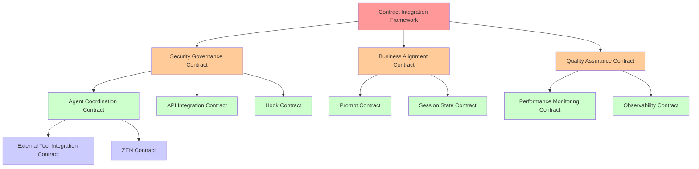

# Better-Claude Governance Framework Overview

## Executive Summary

The Better-Claude governance framework consists of 13 interconnected contracts that establish comprehensive standards for AI-assisted development operations. This framework ensures security, quality, performance, and business alignment across all system components through a hierarchical contract structure with automated enforcement and continuous monitoring.

### Framework Philosophy
- **Token Conservation**: Every operation optimized for 200k token limits with subagent delegation
- **Security-First**: All operations governed by security requirements with zero-trust architecture
- **Business Alignment**: Technical decisions validated against business value and requirements
- **Quality Assurance**: Comprehensive testing and validation at every level
- **Performance Excellence**: Sub-second response times with graceful degradation

## Contract Hierarchy & Dependencies



### Contract Precedence Order

| Tier | Priority | Contracts | Override Authority |
|------|----------|-----------|-------------------|
| **Tier 1** | Highest | Security Governance, Business Alignment | None |
| **Tier 2** | High | Quality Assurance, Agent Coordination | Tier 1 only |
| **Tier 3** | Standard | Hook, Prompt, Session State, Performance, Observability | Tier 1 & 2 |
| **Tier 4** | Specialized | API Integration, External Tool, ZEN | All higher tiers |
| **Meta** | Framework | Contract Integration Framework | Governs all |

## Quick Reference Table

| Contract | Priority | Purpose | Key Metrics | Enforcement |
|----------|----------|---------|-------------|-------------|
| **Contract Integration Framework** | Meta | Meta-governance and conflict resolution | 95% consistency, <24h resolution | Automated + Board |
| **Security Governance Contract** | CRITICAL | Zero-trust security and compliance | 99.9% uptime, <15min MTTD | Automated + Audit |
| **Business Alignment Contract** | CRITICAL | Business value and ROI validation | >15% ROI, 95% requirement compliance | Stakeholder Gates |
| **Quality Assurance Contract** | HIGH | Code quality and testing standards | 80% coverage, <0.1% error rate | Automated Gates |
| **Agent Coordination Contract** | HIGH | Multi-agent orchestration | <100ms latency, >95% success | Runtime Validation |
| **Performance Monitoring Contract** | HIGH | System performance and SLAs | <500ms p95, 99.5% availability | Real-time Monitoring |
| **Hook Contract** | MEDIUM | Hook system governance | 100% security compliance | Code Review + Tests |
| **Prompt Contract** | MEDIUM | Context enhancement and optimization | <2000 tokens, 95% specificity | Template Validation |
| **Session State Contract** | MEDIUM | Context revival and persistence | <3s restore, 100% critical data | Integrity Checks |
| **Observability Contract** | MEDIUM | Logging and monitoring standards | <2s dashboard load, 100% error capture | Log Validation |
| **API Integration Contract** | MEDIUM | External API management | 99.5% uptime, <2s p95 | Health Checks |
| **External Tool Integration Contract** | MEDIUM | CLI tool integration safety | 98% success rate, zero security violations | Command Validation |
| **ZEN Contract** | MEDIUM | Multi-model AI orchestration | Fresh 200k context, XML protocol | Schema Validation |

## Implementation Roadmap

### Phase 1: Foundation (Weeks 1-2) - CRITICAL
**Priority: Immediate**
```
✓ Security Governance Contract - Security-first architecture
✓ Contract Integration Framework - Meta-governance structure
✓ Business Alignment Contract - Value validation framework
□ Quality Assurance Contract - Testing and validation gates
```

### Phase 2: Core Operations (Weeks 3-4) - HIGH
**Priority: Essential**
```
□ Agent Coordination Contract - Multi-agent orchestration
□ Performance Monitoring Contract - SLA enforcement
□ Hook Contract - System extension governance
□ Session State Contract - Context revival mechanisms
```

### Phase 3: Enhancement (Weeks 5-6) - MEDIUM
**Priority: Important**
```
□ Prompt Contract - Context optimization
□ Observability Contract - Comprehensive monitoring
□ API Integration Contract - External service management
□ External Tool Integration Contract - CLI tool safety
```

### Phase 4: Advanced Features (Weeks 7-8) - MEDIUM
**Priority: Valuable**
```
□ ZEN Contract - Multi-model orchestration
□ Advanced workflow automation
□ Cross-contract optimization
□ Performance fine-tuning
```

## Cross-Contract Dependencies Matrix

| Contract | Dependencies | Provides To | Critical Integrations |
|----------|--------------|-------------|----------------------|
| **Contract Integration** | All contracts | Meta-governance | Conflict resolution engine |
| **Security Governance** | None (foundational) | All operations | Authentication, encryption |
| **Business Alignment** | Security | All technical decisions | ROI validation, stakeholder gates |
| **Quality Assurance** | Security, Business | All implementations | Testing gates, metrics |
| **Agent Coordination** | Security, Quality | Hook, ZEN, External Tools | Message routing, resource allocation |
| **Performance Monitoring** | Security, Quality | All operations | SLA enforcement, alerts |
| **Hook Contract** | Security, Agent Coordination | System extensibility | Event handling, validation |
| **Prompt Contract** | Business, Session State | Context enhancement | Token optimization, context injection |
| **Session State** | Security, Performance | Context revival | State persistence, recovery |
| **Observability** | Security, Performance | All operations | Logging, monitoring, debugging |
| **API Integration** | Security, Performance | External services | Rate limiting, fallbacks |
| **External Tool** | Security, Agent Coordination | CLI operations | Command validation, safety |
| **ZEN Contract** | Security, Agent Coordination | AI orchestration | Multi-model delegation |

## Key Integration Points

### 1. Security Pervasive Integration
- **Every contract** must comply with security requirements
- Zero-trust architecture enforced across all operations
- Automatic security validation in all workflows

### 2. Quality Gates at Every Level
- Code quality gates prevent substandard implementations
- Performance gates ensure SLA compliance
- Business value gates validate ROI requirements

### 3. Token Conservation Strategy
- ZEN MCP provides 200k fresh context per subagent
- Prompt optimization reduces token usage by 40%
- Intelligent context pruning and compression

### 4. Real-Time Monitoring & Response
- Performance monitoring with sub-second alerts
- Observability pipeline captures 100% of operations
- Automated recovery for 80% of issues

## Success Metrics & KPIs

### Overall Framework Health
- **Governance Effectiveness**: >95% contract compliance
- **Conflict Resolution**: <24 hours average resolution time
- **Integration Success**: >99% cross-contract compatibility
- **Stakeholder Satisfaction**: >4.5/5.0 rating

### Operational Excellence
- **System Availability**: >99.9% uptime
- **Response Performance**: <500ms p95 for user operations
- **Error Rate**: <0.1% across all operations
- **Security Incidents**: Zero critical breaches

### Business Value Delivery
- **ROI Achievement**: >15% minimum for technical initiatives
- **Requirement Compliance**: >95% BRD/PRD adherence  
- **Time to Market**: <90 days for new features
- **Customer Satisfaction**: >4.5/5.0 NPS improvement

## Risk Mitigation Strategies

### High-Risk Scenarios
1. **Contract Conflicts**: Automated detection with governance board escalation
2. **Security Breaches**: Immediate containment with automated response
3. **Performance Degradation**: Auto-scaling with graceful degradation
4. **Business Misalignment**: Stakeholder gates with executive escalation

### Mitigation Approaches
- **Defense in Depth**: Multiple validation layers
- **Circuit Breakers**: Automatic failure isolation
- **Graceful Degradation**: Essential functions preserved
- **Recovery Automation**: Self-healing capabilities

## Continuous Improvement Framework

### Monthly Reviews
- Contract effectiveness assessment
- Performance metrics analysis  
- Stakeholder feedback integration
- Process optimization opportunities

### Quarterly Evolution
- Framework architecture updates
- New contract development
- Technology integration evaluation
- Strategic alignment validation

### Annual Governance Audit
- Comprehensive compliance review
- External validation assessment
- Framework maturity evaluation
- Strategic roadmap planning

## Compliance & Enforcement

### Automated Enforcement (80%)
- Real-time validation and monitoring
- Automatic policy enforcement
- Circuit breakers for violations
- Performance-based scaling

### Human Oversight (20%)
- Governance board decisions
- Stakeholder approvals
- Exception handling
- Strategic guidance

### Escalation Matrix
1. **Automated Resolution**: 80% of issues handled automatically
2. **Domain Expert Review**: 15% require human intervention  
3. **Governance Board**: 4% need cross-functional decision
4. **Executive Committee**: 1% require strategic guidance

---

## Getting Started

### For Developers
1. Review **Security Governance Contract** and **Quality Assurance Contract**
2. Understand **Hook Contract** for system extensions
3. Follow **External Tool Integration Contract** for CLI tools
4. Leverage **ZEN Contract** for AI-assisted development

### For Architects
1. Study **Contract Integration Framework** for meta-governance
2. Align with **Business Alignment Contract** requirements
3. Design within **Performance Monitoring Contract** SLAs
4. Plan with **Agent Coordination Contract** patterns

### For Stakeholders
1. Understand **Business Alignment Contract** value framework
2. Review **Quality Assurance Contract** standards
3. Monitor **Performance Monitoring Contract** metrics
4. Engage with **Contract Integration Framework** governance

### For Operations
1. Implement **Observability Contract** monitoring
2. Configure **Performance Monitoring Contract** alerts
3. Manage **Session State Contract** persistence
4. Maintain **Security Governance Contract** compliance

---

**Document Status**: Active Framework v1.0  
**Last Updated**: 2025-01-04  
**Next Review**: 2025-02-04  
**Owner**: Better-Claude Governance Board  
**Distribution**: All team members and stakeholders