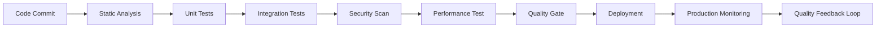

# Quality Assurance Contract

## Purpose
This contract establishes unified quality standards and validation frameworks across all agents and operations within the Claude Code ecosystem. It defines quality gates, testing requirements, and continuous improvement processes to ensure consistent, reliable, and maintainable code and operations.

## Core Principles

### 1. Quality Standards Framework

#### 1.1 Code Quality Requirements
- All code MUST pass static analysis with zero critical issues
- Code coverage MUST exceed 80% for new code, 70% for legacy code
- Cyclomatic complexity MUST not exceed 10 per function
- Technical debt ratio MUST not exceed 5% (SonarQube metric)
- Documentation coverage MUST exceed 90% for public APIs

#### 1.2 Performance Quality Gates
```json
{
  "performance_thresholds": {
    "response_time_p95": "< 200ms",
    "throughput_min": "> 1000 ops/sec", 
    "memory_usage_max": "< 512MB per agent",
    "cpu_usage_avg": "< 60%",
    "error_rate_max": "< 0.1%"
  },
  "scalability_requirements": {
    "concurrent_users": "> 1000",
    "data_volume": "> 10GB",
    "request_rate": "> 10000/min"
  }
}
```

#### 1.3 Security Quality Standards
- All inputs MUST be validated and sanitized
- Secrets MUST never be logged or exposed
- Authentication MUST be multi-factor where applicable
- Authorization MUST follow principle of least privilege
- All security vulnerabilities MUST be remediated within SLA

### 2. Testing Framework Requirements

#### 2.1 Test Coverage Standards
- Unit tests MUST cover all business logic paths
- Integration tests MUST cover all external interfaces
- End-to-end tests MUST cover critical user journeys
- Performance tests MUST validate all SLA requirements
- Security tests MUST cover OWASP Top 10 vulnerabilities

#### 2.2 Test Automation Requirements
```yaml
test_automation:
  unit_tests:
    trigger: "on_code_change"
    timeout: "< 5 minutes"
    success_rate: "> 99%"
  integration_tests:
    trigger: "on_merge_request"
    timeout: "< 15 minutes" 
    success_rate: "> 98%"
  e2e_tests:
    trigger: "on_deployment"
    timeout: "< 30 minutes"
    success_rate: "> 95%"
  performance_tests:
    trigger: "nightly"
    duration: "1 hour"
    baseline_comparison: "required"
```

#### 2.3 Test Data Management
- Test data MUST be anonymized and GDPR compliant
- Test environments MUST be isolated and reproducible
- Test data MUST be version controlled and auditable
- Production data MUST never be used in test environments

### 3. Continuous Quality Monitoring

#### 3.1 Quality Metrics Collection
- Code quality metrics MUST be collected on every commit
- Performance metrics MUST be collected continuously
- User experience metrics MUST be tracked and analyzed
- Security metrics MUST be monitored in real-time
- Business impact metrics MUST be correlated with quality

#### 3.2 Quality Gates Enforcement
- Pre-commit hooks MUST enforce code quality standards
- Merge requests MUST pass all quality gates before approval
- Deployments MUST be blocked on quality gate failures
- Production monitoring MUST trigger rollbacks on quality degradation

## Implementation Requirements

### 1. Quality Pipeline Architecture


### 2. Tool Integration Requirements
- SonarQube for static code analysis and technical debt tracking
- JUnit/pytest for unit testing with coverage reporting
- Selenium/Playwright for end-to-end testing
- OWASP ZAP for security testing
- JMeter/k6 for performance testing
- Grafana/Prometheus for quality metrics visualization

### 3. Quality Dashboard Implementation
- Real-time quality metrics dashboard
- Historical trend analysis and reporting
- Quality gate status and failure analysis
- Technical debt tracking and remediation planning
- Quality score calculation and benchmarking

## Validation Criteria

### 1. Quality Score Calculation
```python
def calculate_quality_score():
    weights = {
        'code_quality': 0.25,
        'test_coverage': 0.20,
        'performance': 0.20,
        'security': 0.20,
        'documentation': 0.15
    }
    
    # Each metric scored 0-100
    score = (
        code_quality * weights['code_quality'] +
        test_coverage * weights['test_coverage'] +
        performance * weights['performance'] +
        security * weights['security'] +
        documentation * weights['documentation']
    )
    return score
```

### 2. Quality Gate Criteria
- Minimum quality score: 80/100
- Zero critical security vulnerabilities
- All tests passing with required coverage
- Performance within acceptable thresholds
- Documentation completeness verified

### 3. Release Quality Standards
- Quality score trend: Improving or stable over 30 days
- Zero known critical or high severity issues
- All security requirements validated
- Performance benchmarks met or exceeded
- User acceptance criteria satisfied

## Enforcement Mechanisms

### 1. Automated Enforcement
- Git hooks prevent commits below quality threshold
- CI/CD pipelines block deployments on quality failures
- Automated rollbacks on production quality degradation
- Security vulnerabilities trigger immediate alerts
- Performance degradation triggers auto-scaling or rollback

### 2. Process Enforcement
- Code review requirements with quality focus
- Quality champion role in each team
- Regular quality reviews and retrospectives
- Quality metrics in team performance reviews
- Quality improvement initiatives tracked and rewarded

### 3. Governance Enforcement
- Quality standards documented and communicated
- Regular quality audits and assessments
- Quality training programs for all team members
- Quality metrics included in business reporting
- Executive dashboards showing quality trends

## Integration Points

### 1. Agent Coordination Integration
- Quality metrics shared across agent communications
- Quality gate failures block agent task assignments
- Quality trends influence agent workload distribution
- Quality alerts trigger agent coordination protocols

### 2. Hook System Integration
- PreToolUse hooks validate quality requirements
- PostToolUse hooks update quality metrics
- Quality gate failures trigger notification hooks
- Quality improvements tracked through hook events

### 3. Business Alignment Integration
- Quality metrics aligned with business objectives
- Quality improvements tracked against business value
- Quality issues escalated based on business impact
- Quality investments justified through business cases

## Continuous Improvement Framework

### 1. Quality Feedback Loops
- Automated quality trend analysis
- Root cause analysis for quality regressions
- Quality improvement suggestions and recommendations
- Quality best practices sharing and adoption

### 2. Quality Innovation
- Emerging quality tools evaluation and adoption
- Quality process automation and optimization
- Quality metrics refinement and enhancement
- Quality standard evolution and updates

### 3. Quality Culture
- Quality awareness training and education
- Quality success stories sharing and celebration
- Quality failure post-mortems and learning
- Quality mindset embedding in daily operations